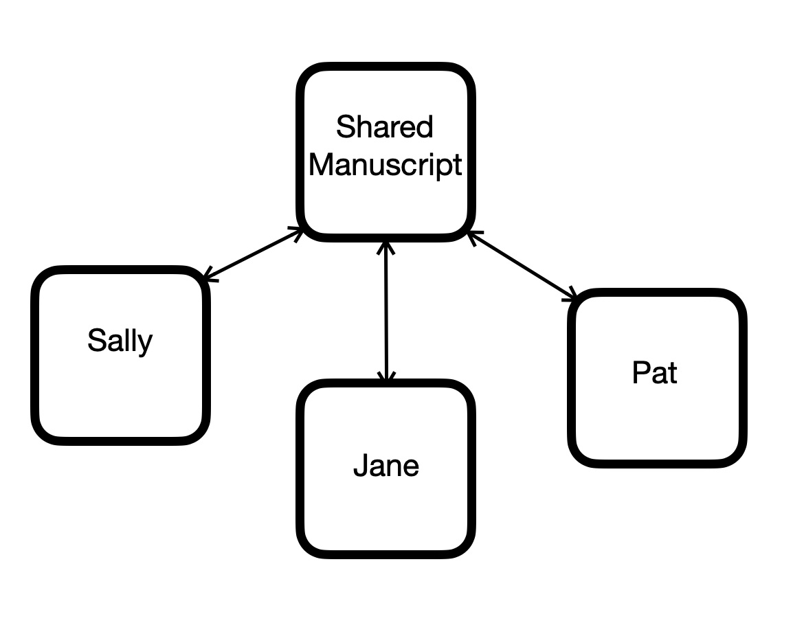

# Introduction to GIT
### An opionated guide

## Maria Mckinley
## Assisted by Franco Mattos Neto

# Outline
* Introduction to GIT
* Demonstration of using GIT

Disclosure: This talk is about understanding how to use git, so I will not be going into
certain details, like installing git. I will have links for instructions and feel free
to ping me on slack later for help.

## Problems with the "system" in the cartoon:
* often not obvious which version contains which changes
* often not easy to "revert" changes
* often not clear who changed what
* often not clear how to combine changes from different versions

## Version control
## is the practice of tracking and managing changes to software code.
## Version control systems
## are software tools that help software teams manage changes to source code over time.

* Git keeps track of history
* Serves as a backup
* Assists you to create a system for easier collaboration
* Can be used to enforce standards

## Some definitions
* Repo (Repository): a collection of files and folders that make a body of work
* Git:  a tool for saving history along with the body of work
* GitHub/GitLab:  a repository copy that everyone can reach and use

## Some important concepts
* All contributers have their own repo copy, including GitHub/GitLab
* Contributers are responsible to keep local copy aligned with central
* The more contributer's copies diverge, the more painful syncing

## More Definitions
* Merge: Combine changes from more than one copy

## Let's talk about the computer file system for a moment

## Git puts everything it needs to keep track of changes in a hidden directory called
## .git in the root directory of each repository

## Installation: I like GitLab's instructions, but others are available
https://docs.gitlab.com/ee/topics/git/how_to_install_git/index.html
## Full, well laid out tutorial
https://docs.gitlab.com/ee/tutorials/make_your_first_git_commit.html

## Tools I chose for this Demo
* Command line
* Editor: emacs
* Git Central Repo: GitLab

# Outline
* Introduction to GIT
* Demonstration of using GIT

# Let's create a repo
* command line: `git init`  
* https://gitlab.disney.com/projects/new
* https://docs.github.com/en/get-started/quickstart/create-a-repo

## How to set up ssh keys for authenticating - Highly recommended
### GitLab
https://docs.gitlab.com/ee/user/ssh.html
### Github
https://docs.github.com/en/authentication/connecting-to-github-with-ssh

## What's an origin?
* shorthand name for remote repo a project was cloned from
* default for further communication
* name is just a convention

## How do I see what is the origin?
`git remote -v`

## Workflow
* re-orient yourself to work
* see if others have made changes
* do your work

### Workflow continued
* decide on content for current change
* select what will be in the change
* add a descriptive note to your change
* put your changes in the common repo so everyone sees your changes

## Workflow
| Command | Description |
| ------- | --------- |
| `git status`  | re-orient yourself to work |
| `git pull`  | see if others have made changes needs network |
|                                     | do work |

### Workflow continued
| Command | Description |
| ------- | --------- |
| `git diff` and/or `git status`  | tools to decide on content |
| `git add`  | select what's included |
| `git commit`  | add a descriptive note |
| `git push`  | add changes to the common repo needs network |

## What's a commit?
* one or more changes made to a repo
* a revision
* how the repo looks now that these changes have been made
* a snapshot of your repo at a moment in time

## Anatomy of a status response
| Output | Description |
| ------ | --------- |
| `On branch main` | branch currently on |
| `Your branch is up to date with 'origin/main'.` | commits all pushed to branch 'origin/main'|
| `Your branch is ahead of 'origin/main' by 1 commit.` | commits not pushed to branch 'origin/main' |

### Anatomy of a status response continued
| Output | Description |
| ------ | --------- |
| `Changes not staged for commit:` | files with changes that have not been tagged for commit |
| `Changes to be committed:` | files with changes that have been tagged for commit |
| `Untracked files:` | files not ever recorded in git |

# Thank you
# A git pull a day keeps the conflicts away

### https://codedragon.github.io/beginning_git
### maria@mariakathryn.net
